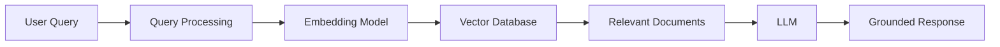

# 👋 Hi, I'm Akash Singh

### Computer Science Engineer • Backend & AI/GenAI Builder

I’m a Computer Science undergraduate at **NIT Srinagar** focused on building backend systems, AI-powered applications, and scalable software architectures.

I enjoy working at the intersection of **Backend Engineering, AI/GenAI, System Design, and intelligent systems research**, while continuously improving through **DSA and competitive programming**.

<p align="center">
  <a href="YOUR_LINKEDIN_URL">LinkedIn</a> •
  <a href="YOUR_LEETCODE_URL">LeetCode</a> •
  <a href="YOUR_PORTFOLIO_URL">Portfolio</a> •
  <a href="mailto:YOUR_EMAIL">Email</a>
</p>

---

## 🚀 What I Do

```text
Backend Engineering & Systems
        +
AI / GenAI
        +
System Design
        +
AI/ML Research
        +
DSA / Competitive Programming
```

---

## 🧠 About Me

* 🎓 B.Tech Computer Science & Engineering @ **NIT Srinagar**
* 📊 **9.06/10 CGPA**
* 💻 Building backend systems with **Node.js, Express.js, FastAPI & REST APIs**
* 🤖 Building AI/GenAI applications using **RAG, LangChain, LCEL & Vector Databases**
* 🏗️ Interested in **Microservices, System Design, scalable backend architectures & distributed systems**
* 🔬 AI/ML Research experience at **IIT BHU**, working around Neural Architecture Search and Evolutionary Algorithms
* 🧩 **600+ DSA problems solved**
* 🏆 **1650+ LeetCode Contest Rating**
* 🌎 Ranked **4th in India & 54th globally** in the Proggy Buggy International Programming Contest
* 🥉 **3rd place** — IUST Coding Hackathon 2025

---

## 🛠️ Tech Stack

### Languages

<p>


</p>

### Backend & Systems

<p>


</p>

### AI / GenAI / ML

<p>


</p>

### Frontend

<p>


</p>

### Databases & Cloud

<p>


</p>

---

# 🚀 Featured Projects

## 📚 EdraFlow V2.0 — AI-Powered Academic Platform

> A multi-service academic platform combining full-stack development with production-oriented AI/RAG systems.

**Stack:** React 19 • Node.js • FastAPI • LangChain • FAISS • ChromaDB • Groq • MongoDB • AWS

### Highlights

* 🏗️ Architected a **multi-language microservices platform** with React, Node.js and two FastAPI services.
* 🤖 Built an AI chatbot using **FAISS, Groq Llama 3.1-8B and dual-layer hallucination guardrails**.
* 📄 Developed a PDF Chat engine using **LangChain LCEL and session-isolated ChromaDB vector stores**.
* 🔎 Implemented **page-level source citations** for PDF question answering.
* 🔐 Built **15+ REST APIs** with JWT authentication and role-based access control.
* ⚡ Added input validation, rate limiting and asynchronous workflows.
* ☁️ Deployed using **AWS EC2, Nginx, PM2, Vercel and Render**.

[🔗 Source Code](YOUR_EDRAFLOW_GITHUB_URL) • [🌐 Live Demo](YOUR_EDRAFLOW_DEMO_URL)

---

## 🚇 Delhi Metro PathFinder

> Intelligent metro route planning system using graph algorithms and a lightweight C++ backend.

**Stack:** C++11 • Graph Algorithms • Dijkstra • REST API • cpp-httplib • JavaScript

* 🗺️ Modeled **300+ metro stations across 11 lines** as a weighted graph.
* ⚡ Implemented priority-queue based **Dijkstra's Algorithm** for efficient route computation.
* 🔄 Added **transfer-aware edge weights** for more realistic route optimization.
* 🌐 Built a lightweight C++ REST API using **cpp-httplib**.
* 📊 Developed a frontend for route, travel-time, station-count and interchange visualization.

[🔗 Source Code](YOUR_METRO_GITHUB_URL)

---

## 🛡️ ToxicityInsight — Real-Time NLP Moderation System

> Real-time text moderation API using classical machine learning and NLP.

**Stack:** Python • FastAPI • Scikit-Learn • TF-IDF • Logistic Regression

* 🧠 Built a multi-class toxicity classification pipeline.
* 🔤 Used **TF-IDF feature engineering** with Logistic Regression.
* 📈 Achieved **85% accuracy** and **0.86 weighted F1-score** on 4,957 unseen samples.
* ⚙️ Optimized preprocessing and class weighting to improve minority-class recall.
* 🚀 Exposed predictions through a low-latency FastAPI REST service.

[🔗 Source Code](YOUR_TOXICITYINSIGHT_GITHUB_URL)

---

# 🏗️ System Design & Backend Engineering

I enjoy understanding **why systems are designed a certain way**, not just implementing APIs.

Areas I'm actively exploring:

```text
Client → API Gateway → Backend Services → Database
                       │
                       ├── Cache
                       ├── Message Queue
                       ├── Object Storage
                       └── Observability
```

### Current focus

* REST API Design
* Authentication & Authorization
* Rate Limiting
* Caching
* Database Design
* Microservices
* Asynchronous Processing
* Load Balancing
* Scalability
* Fault Tolerance
* Observability
* Distributed Systems

---

# 🤖 AI / GenAI

My AI/GenAI work focuses on building **complete systems around models**, rather than only calling an LLM API.

### Areas

* Retrieval-Augmented Generation (RAG)
* LangChain & LCEL
* Vector Databases
* Embeddings
* Semantic Search
* LLM Evaluation
* Hallucination Guardrails
* NLP
* Scikit-Learn
* AI-powered backend services

### RAG Architecture



---

# 🔬 Research

### AI/ML Research Intern — IIT BHU

**Dec 2025 – Feb 2026**

Research interests included:

* Neural Architecture Search
* Evolutionary Algorithms
* Deep Learning Optimization
* Literature Review
* Experimental Prototyping
* Baseline Model Validation

I explored how **evolutionary approaches can be used to search and optimize neural architectures**, while experimenting with research ideas and baseline implementations.

---

# 🧩 DSA & Competitive Programming

Problem solving is a major part of my engineering journey.

<div align="center">

### 600+ DSA Problems Solved

### 🟢 1650+ LeetCode Contest Rating

</div>

### Competitive Programming Highlights

🏆 **4th in India / 54th Globally** — Proggy Buggy International Programming Contest

🥉 **3rd Place** — IUST Coding Hackathon 2025 among 50+ teams

🏆 **Finalist** — EIBS IIT Kharagpur 2026

---

# 📊 LeetCode

<div align="center">

<a href="YOUR_LEETCODE_URL">
  
</a>

</div>

---

# 📈 GitHub Statistics

<div align="center">


</div>

---

# 🌱 Currently Learning

```text
System Design
      ↓
Distributed Systems
      ↓
Scalable Backend Architecture
      ↓
Advanced RAG / GenAI Systems
      ↓
AI Agents & Intelligent Systems
```

I’m particularly interested in understanding how **backend systems and AI systems can be designed to remain reliable, scalable and maintainable as complexity grows.**

---

# 🎯 Engineering Philosophy

> **Don't just make it work. Understand why it works, how it scales, and where it breaks.**

I like turning ideas into working systems, understanding the engineering trade-offs behind them, and continuously improving both the implementation and the underlying design.

---

# 🤝 Let's Connect

<p align="center">

<a href="YOUR_LINKEDIN_URL">

</a>

<a href="YOUR_LEETCODE_URL">

</a>

<a href="mailto:YOUR_EMAIL">

</a>

</p>

---

<div align="center">

### ⭐ Thanks for visiting my profile!

**Building • Learning • Researching • Solving**

</div>
# AkashSingh040
